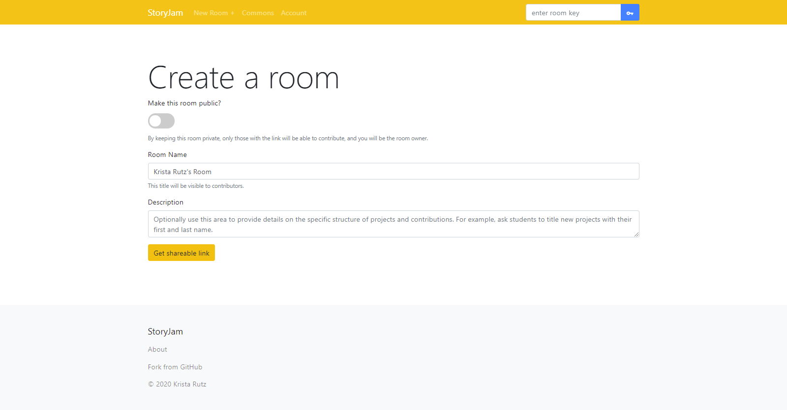
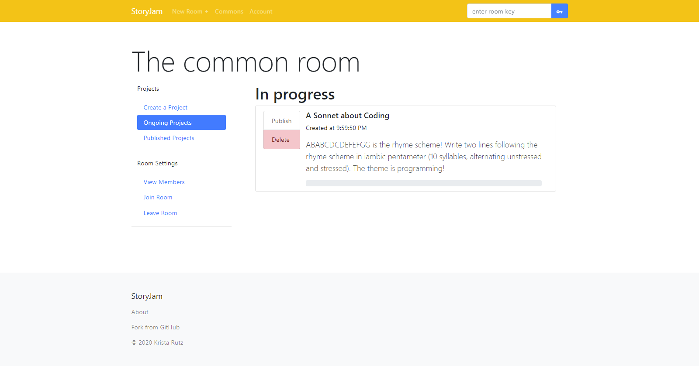
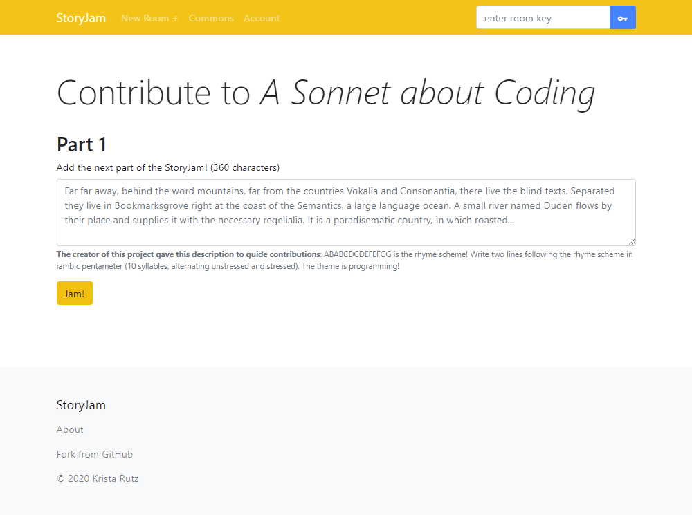
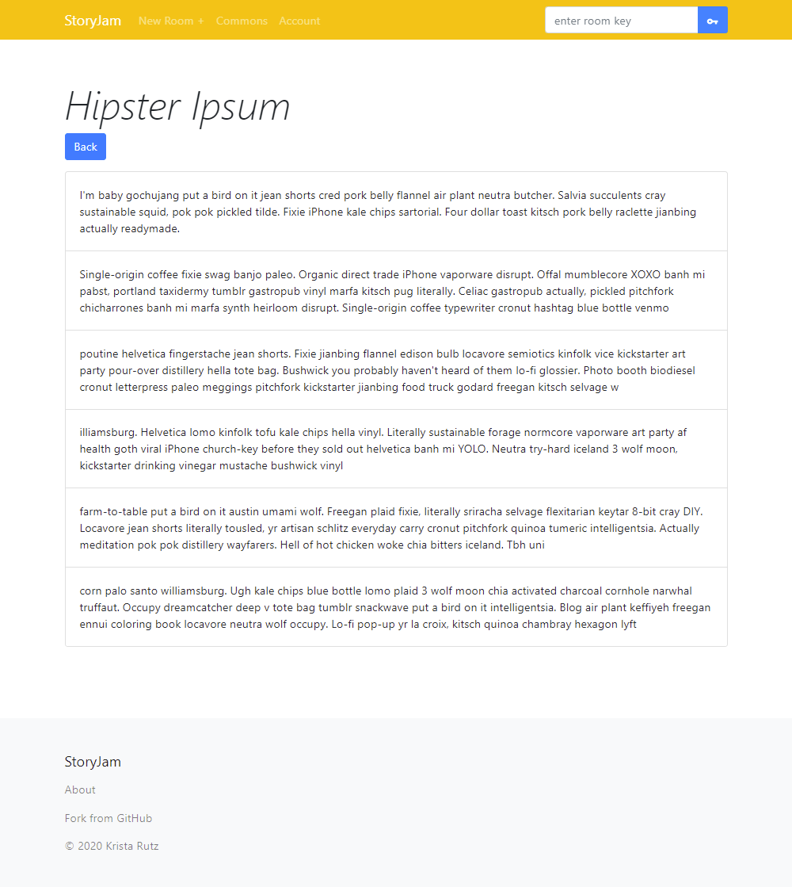
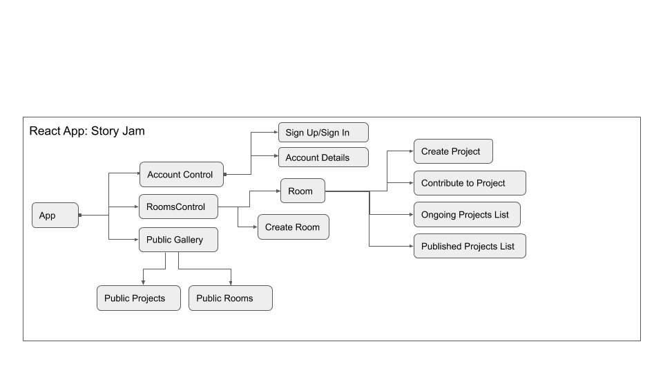
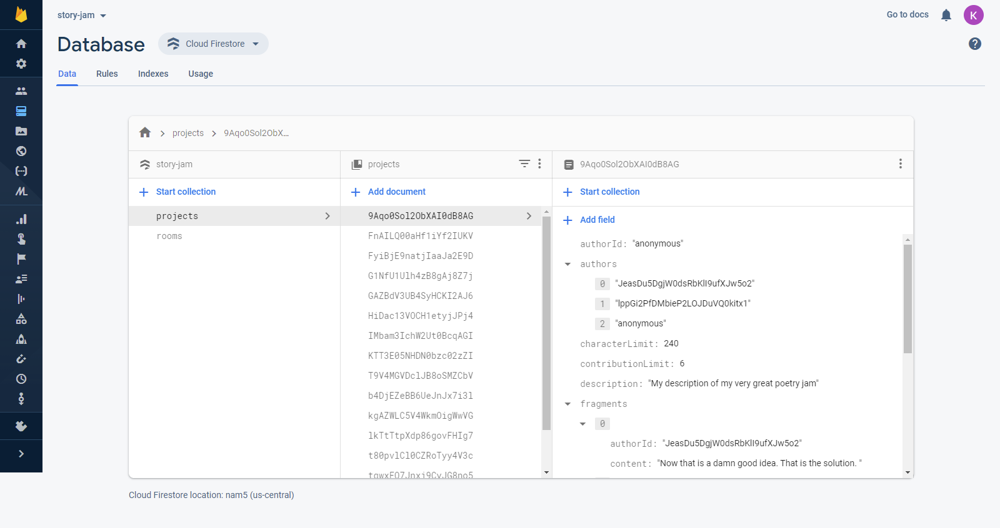
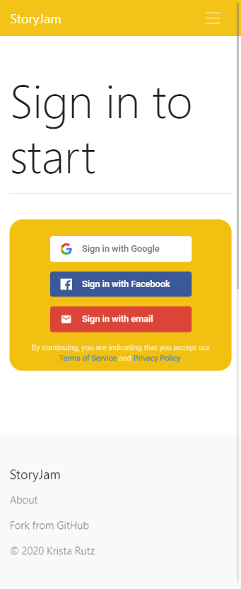

# (StoryJam)[https://story-jam.firebaseapp.com/]

#### A React/Firebase application for collaborative writing, last updated _05.22.2020_

## By **Krista Rutz**

   

[Description](#Description) | [Technologies](#Technologies-Used) | [Component Diagram](#Component-Diagram) | [Run or Install](#Set-up) | [Known Bugs](#Known-Bugs) | [Contact and Support](#Support-and-Contact-Details) | [License](#License)

## Description

### This application, based on a tradition of using physical paper to hide previous work in an "exquisite corpse" methodology, allows a group of users to collectively build story that grows synergistically with each contribution.

### _The pitch presentation can be found [on Google Slides](https://docs.google.com/presentation/d/14aRqIYljajNijRXacMrbP1AJL0_QEwlR_JGi-O9-kcU/edit?usp=sharing)._

Similar to the parlour games of mad libs, consequences, or [Exquisite Corpse](https://en.wikipedia.org/wiki/Exquisite_corpse), a Surrealist technique to create stories or works of art as a group, StoryJam allows people to work together to write a more interesting story. Each person takes turns contributing without being able to see or predict the total outcome. As the story gets larger, the contributions have a lower chance of fitting well together, adding an element of amusement and surprise.

StoryJam a platform that enables people to use this technique electronically, with people that might not be sitting right next to them in the parlour. A user might receive a partially complete story or poem and be prompted to add a few lines, some exposition, or a new plot development before sending it on to the next user to grow the story. For more information, visit the site's (About Page)[https://story-jam.firebaseapp.com/about].

### Usage

#### Create an account or sign in

Use one of our providers or create a new account using email for a better experience.

#### Create a room

Make a private room and send the key to your friends.

#### Enter a room

Enter your room using a key, or visit the commons (a room open to all users).

#### Contribute to projects

Start new projects and then build on each others' work by adding brief additions to the project, while only seeing the most recent contribution.

#### Read published projects

After a number of contributions, projects can be published to reveal the amusing or insightful collaborative creation.

### Technologies Used:

- Written in JavaScript
- Node.js package manager
- React.JS, Redux state container, and JSX/HTML
- Firebase auth and hosting
- Cloud Firestore NoSQL database
- Custom CSS and React-Bootstrap library
- Git version control and GitHub
- Visual Studio Code
- Several npm packages 

  - bootstrap, version 4.4.1
  - firebase, version 7.14.4
  - firebaseui, version 4.5.0
  - react, version 16.13.1
  - react-bootstrap, version 1.0.1
  - react-dom, version 16.13.1
  - react-firebaseui, version 4.1.0
  - react-icons, version 3.10.0
  - react-redux, version 7.1.3
  - react-redux-firebase, version 3.1.1
  - react-router-dom, version 5.1.2
  - react-scripts 3.4.1
  - redux, version 4.0.5
  - redux-firestore, version 0.12.0
  

### Component Diagram

## Set-up

#### This project is best run from a browser, where it can be found at (https://story-jam.firebaseapp.com/)[https://story-jam.firebaseapp.com/].

Those wishing to clone the repository from GitHub and enter the folder may do so from the command line by running the following commands.
`$ git clone https://github.com/KristaRutz/story-jam.git`
`$ cd story-jam`

Locally, this project requires a '.env' file containing the environment variables for a firebase app connection. Create this file in the root directory of the project, replacing each constant with the firebase generated string. You will need to make your own firebase account and application to run this project. This is necessary in order to populate data from the database and to update the database with new data. Complete this step before attempting to run a build or start a local development server.

REACT_APP_FIREBASE_API_KEY = {api key}
REACT_APP_FIREBASE_AUTH_DOMAIN = {domain url}
REACT_APP_FIREBASE_DATABASE_URL = {database url}
REACT_APP_FIREBASE_PROJECT_ID = {project id}
REACT_APP_FIREBASE_STORAGE_BUCKET = {storage bucket}
REACT_APP_FIREBASE_MESSAGING_SENDER_ID = {messaging sender id}
REACT_APP_FIREBASE_APP_ID = {firebase app id}
REACT_APP_FIREBASE_MEASUREMENT_ID = {measurement id}

The database structure should eventually look like this:

The basic commands for running this project on a local server can be executed after the previous steps are carried out.
`$ npm install`
`$ npm run build`
`$ npm start`

Because this project was developed with Create-React-App, please look at the [included information](./CRD.md) and React documentation for information about ejecting this project.

## Known Bugs

Software is currently usable in beta but still has several features in development. See the [parking lot of issues](./parkinglot.md) for higher-level information on features that are still under development, which may result in bugs or incomplete information.

Mobile use should be fully supported in the browser, but let me know if you encounter an issue!

## Support and Contact Details

Please contact me if you run into any bugs!! I am also interested in hearing any questions, ideas or concerns about the application. I can be contacted at <krista.rutz@pomona.edu>.

Feel free to create a Pull Request for updates to the code!

## License

Copyright (c) 2020 **_Krista Rutz_**

_This software is licensed under [the GPL-2.0 license](./LICENSE)._
